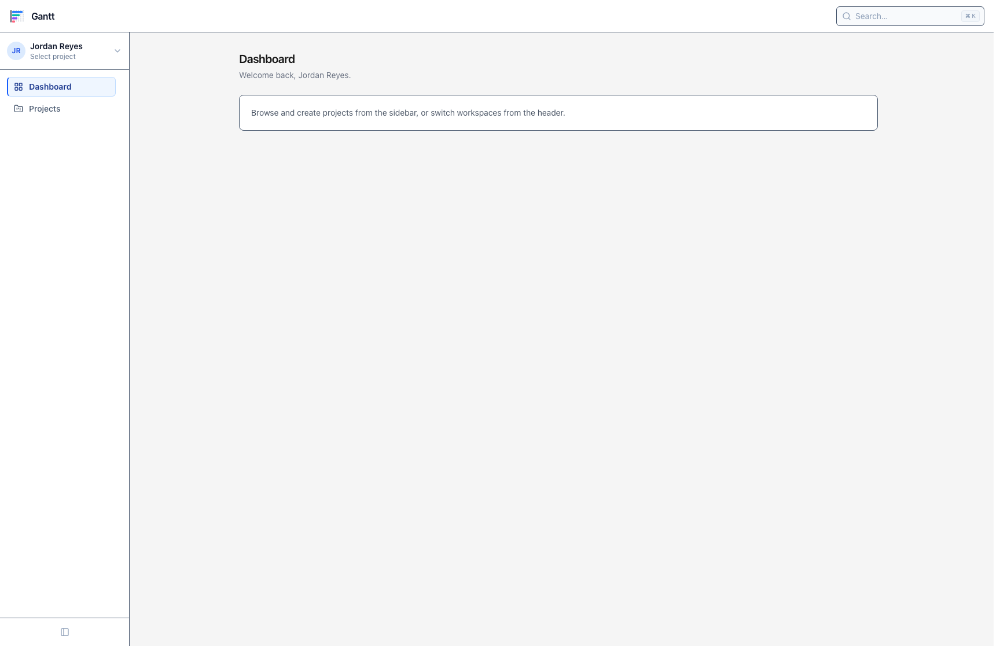
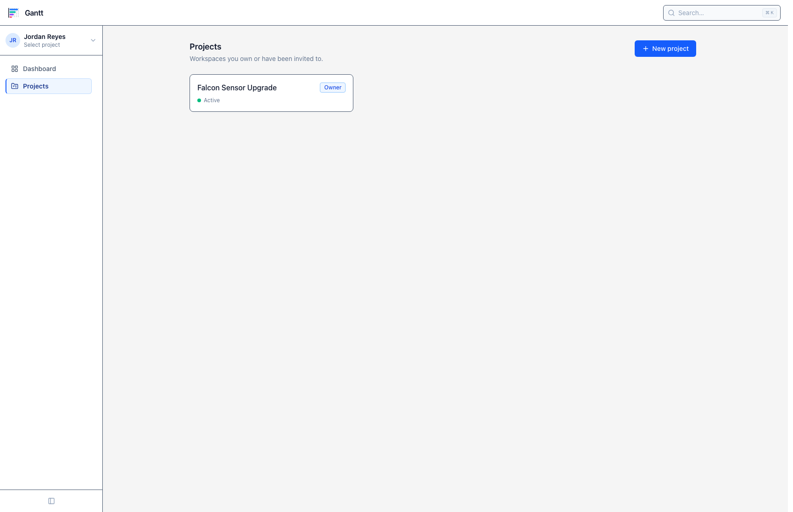
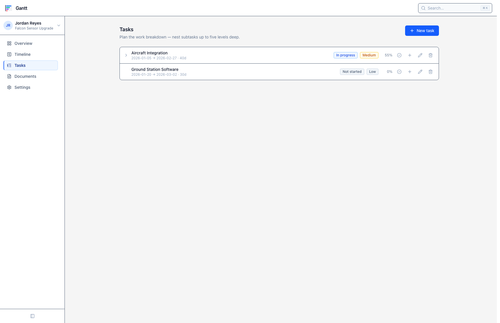
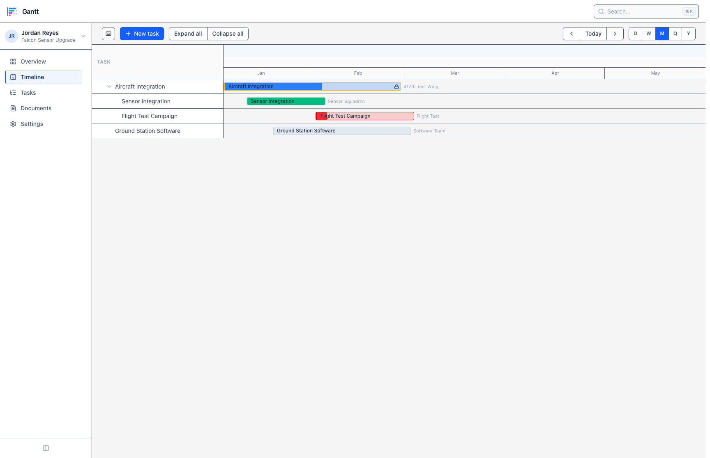
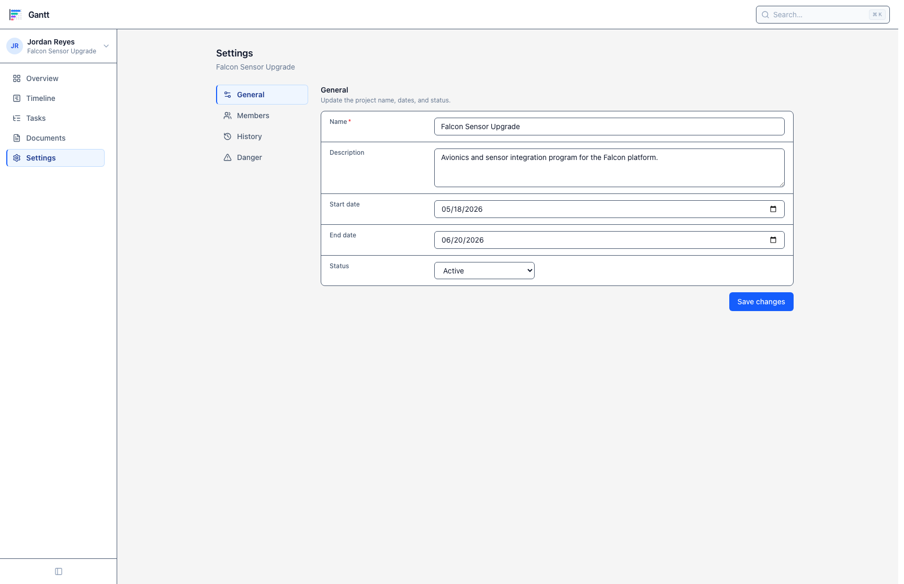

# Gantt — Design System

This document captures the design system extracted from the current application: the
design tokens, color semantics, typography, spacing, and the React UI primitives that
every page composes from. It is descriptive of what exists today, not aspirational.

**Stack:** Tailwind CSS v4 · React 19 · Inertia v3 · `lucide-react` icons.
All primitives live in `resources/js/components/ui/`, shell chrome in
`resources/js/components/shell/`, and shared class helpers in `resources/js/utils/`.

---

## 1. Foundations

### 1.1 Theme tokens

Tokens are defined in `resources/css/app.css` under `@theme`. The two ideas to know:

1. **`accent-*` is an alias for Tailwind `blue-*`.** Components never reference `blue`
   directly — they use `accent-600`, `accent-50`, etc. Re-theming the product is a
   one-line change.
2. **Borders have a dedicated token per mode:** `border` (light, `slate-600`-derived)
   and `border-dark` (`neutral-600`). Almost every surface pairs
   `border-border dark:border-border-dark`.

```css
@theme {
    --font-sans: ui-sans-serif, system-ui, -apple-system, sans-serif, 'Apple Color Emoji', 'Segoe UI Emoji';
    --color-border: var(--color-slate-600);
    --color-border-dark: var(--color-neutral-600);
    --color-accent-50:  var(--color-blue-50);
    /* …100–900… */
    --color-accent-950: var(--color-blue-950);
}
```

Dark mode is class-based:

```css
@custom-variant dark (&:where(.dark, .dark *));
```

### 1.2 Color semantics

The palette is intentionally narrow. Each hue carries a fixed meaning across the app.

| Role | Light surface | Meaning / usage |
| --- | --- | --- |
| **Accent (blue)** | `accent-600` fill, `accent-50` tint | Primary actions, active nav, in-progress status, focus rings, links |
| **Neutral (slate / neutral)** | `slate-*` light, `neutral-*` dark | Text, borders, surfaces, "not started" state |
| **Success (emerald)** | `emerald-500` | Complete tasks, success toasts |
| **Warning (amber)** | `amber-400/500` | Medium risk, warning toasts |
| **Danger (red)** | `red-600` | Destructive buttons, blocked tasks, high risk, errors |

**Light/dark surface convention:** light mode uses **slate** for cool grays (text,
borders, tracks); dark mode uses **neutral** for chrome. The two are not interchangeable
— `slate` reads as the "content" gray, `neutral` as the "shell" gray. Weekends on the
timeline deliberately break out to warm **stone** so they don't read as a status color.

### 1.3 Typography

Single `--font-sans` system stack. There is no separate display face. Size is the
primary hierarchy signal; weight is secondary.

| Token | Usage |
| --- | --- |
| `text-lg font-semibold` | Page titles (`PageHeader`, project name) |
| `text-sm font-semibold` | Section/card/modal titles |
| `text-sm` | Body copy, form controls, menu items, buttons |
| `text-xs font-medium` | Field labels, badges, descriptions, dropdown labels |
| `text-[10px]` / `text-[11px]` | Keyboard hints, "soon" pills, timeline axis micro-labels |

Body text color is `text-slate-900 dark:text-white` for primary, `text-slate-500/600
dark:text-neutral-400` for secondary/muted.

### 1.4 Spacing, radius & elevation

- **Radius:** `rounded-md` (controls, buttons, menu items) · `rounded-lg` (cards,
  modals, large inputs, fieldsets) · `rounded` (badges) · `rounded-full` (avatars,
  scrollbar thumbs).
- **Control padding:** buttons `px-4 py-2` (default), `px-3 py-1.5` (sm); inputs
  `px-3 py-1.5`. These two rhythms (`py-1.5` / `py-2`) cover almost everything.
- **Layout gaps:** page sections stack with `gap-6`; control clusters use `gap-2`;
  icon+label rows use `gap-2.5`.
- **Elevation is minimal:** flat bordered surfaces are the default. Shadows appear only
  on floating layers — `shadow-lg` (dropdowns), `shadow-md` (toasts), `shadow-sm`
  (occasional). Modals dim with `bg-slate-900/50 dark:bg-black/60`, no shadow.

### 1.5 Focus rings

Keyboard focus is a first-class, centralized concern. `resources/js/utils/focusRing.ts`
exports five ring presets; **components never hand-roll focus styles**, they import one.
All are `focus-visible:` (keyboard only) and use the accent color with a canvas-colored
offset.

```ts
export const focusRingPrimary  = 'focus-visible:outline-none focus-visible:ring-2 focus-visible:ring-accent-800 focus-visible:ring-offset-2 …';
export const focusRingNeutral  = '…ring-accent-700 ring-offset-2 ring-offset-white dark:ring-accent-400…'; // ghost/links/secondary
export const focusRingCheckbox = '…compact ring for native checkboxes…';
export const focusRingInputMd  = '…ring-2 ring-accent-500 + focus border…'; // inputs / selects / textareas
export const focusRingInputLg  = '…softer ring-accent-500/30…';            // large guest inputs
```

### 1.6 Custom scrollbars

Thin, theme-aware scrollbars are defined globally in `app.css` via CSS variables
(`--scrollbar-thumb`, etc.) and applied to `*`. `html` sets `scrollbar-gutter: stable`
to prevent layout shift when content overflows.

### 1.7 The `cn` helper

A tiny truthy-join utility (`resources/js/utils/cn.ts`) — **not** `clsx`/`tailwind-merge`.
It concatenates; it does not de-duplicate conflicting classes. Order your overrides last.

```ts
export function cn(...classes: (string | false | null | undefined)[]): string {
    return classes.filter(Boolean).join(' ');
}
```

---

## 2. Core UI primitives

### 2.1 Button — `components/ui/button.tsx`

Four variants × three sizes. The class logic is exported as `buttonClasses()` so links
can be styled as buttons (`ButtonLink`, which wraps Inertia `<Link>`).

| Variant | Look |
| --- | --- |
| `primary` | Solid `accent-600` fill, white text |
| `secondary` | White surface, `border`, slate text |
| `danger` | Solid `red-600` fill |
| `ghost` | Transparent, tint on hover — for icon/toolbar actions |

| Size | Padding |
| --- | --- |
| `default` | `px-4 py-2` |
| `sm` | `px-3 py-1.5` |
| `icon` | `p-2` (square) |

```tsx
const variants: Record<ButtonVariant, string> = {
    primary: cn('bg-accent-600 text-white hover:bg-accent-500 disabled:opacity-50 dark:bg-accent-500 dark:hover:bg-accent-400', focusRingPrimary),
    secondary: cn('border border-border bg-white text-slate-700 hover:bg-slate-50 dark:border-border-dark dark:bg-neutral-800 dark:text-neutral-300 dark:hover:bg-neutral-700', focusRingNeutral),
    danger: cn('bg-red-600 text-white hover:bg-red-500 disabled:opacity-50', focusRingPrimary),
    ghost: cn('text-slate-400 hover:bg-slate-100 hover:text-slate-700 dark:hover:bg-neutral-800 dark:hover:text-neutral-200', focusRingNeutral),
};

// shared base: inline-flex items-center justify-center rounded-md text-sm font-medium transition
<Button>Save changes</Button>
<Button variant="secondary" size="sm">Cancel</Button>
<Button variant="ghost" size="icon" aria-label="Delete"><Trash2 className="h-4 w-4" /></Button>
<ButtonLink href={create.url()}>New project</ButtonLink>
```

### 2.2 Form controls — `input.tsx`, `select.tsx`, `textarea.tsx`, `label.tsx`

All three controls share the same skin: `border border-border bg-white px-3 text-sm`,
dark `bg-neutral-800`, `focusRingInputMd`. `Input` adds a `size` prop (`md` rounded-md /
`lg` rounded-lg for guest screens). All are `forwardRef`.

```tsx
// Input base
'block w-full border border-border bg-white px-3 text-sm text-slate-900 placeholder:text-slate-400
 dark:border-border-dark dark:bg-neutral-800 dark:text-white dark:placeholder:text-neutral-500'

<Label htmlFor="name">Name</Label>   {/* text-xs font-medium text-slate-600 */}
<Input id="name" size="lg" />
<Select><option>Active</option></Select>
<Textarea rows={3} />
```

### 2.3 Card — `components/ui/card.tsx`

The default surface: `rounded-lg border bg-white dark:bg-neutral-900`, `p-5`. Pass
`padding="none"` when the card wraps its own list/table.

```tsx
<Card>…</Card>
<Card padding="none"><Table … /></Card>
```

### 2.4 Badge — `components/ui/badge.tsx`

Small status pill, five tones. Tone is chosen semantically — see §3 for the
status→tone mapping. Each tone is a triplet of `border + bg + text` with a dark variant.

```tsx
export type BadgeTone = 'neutral' | 'accent' | 'success' | 'warning' | 'danger';
// base: inline-flex items-center rounded px-2 py-0.5 text-xs font-medium
<Badge tone="accent">In progress</Badge>
<Badge tone="success">Complete</Badge>
<Badge tone="danger">Blocked</Badge>
```

### 2.5 Avatar — `components/ui/avatar.tsx`

Initials-only (max 2), `rounded-full`, accent tint. No image support.

```tsx
<Avatar name="Jordan Reyes" />  // → "JR" on bg-accent-100 text-accent-700
```

### 2.6 Modal — `components/ui/modal.tsx`

Centered dialog over a dimming backdrop. Closes on Escape and backdrop click; locks body
scroll while open. Sizes `md` / `lg` / `xl` (`max-w-md` → `max-w-4xl`).

```tsx
<Modal open={open} onClose={close} title="Update progress" size="md">
    …
</Modal>
```

### 2.7 Dropdown menu — `components/ui/dropdown-menu.tsx`

Compound component (`DropdownMenu` / `Trigger` / `Content` / `Item` / `Label` /
`Separator`) built on React context. Handles outside-click and Escape. `Content` can be
`portaled` to `document.body` (escapes `overflow` clipping) and placed `bottom-start` or
`right-start`. Panel: `min-w-52 rounded-md border bg-white py-1 shadow-lg`.

### 2.8 Tooltip — `components/ui/tooltip.tsx`

Portaled, fixed-position tooltip (not clipped by overflow), shown on hover **and** focus,
`top`/`bottom` placement. Dark slate bubble: `bg-slate-900 text-white text-xs`. A separate
`SidebarTooltip` handles the collapsed-rail case.

### 2.9 Keyboard shortcut — `components/ui/keyboard-shortcut.tsx`

Renders a `<kbd>` that swaps `⌘`/`Ctrl` based on platform detection (via
`useSyncExternalStore`, SSR-safe).

```tsx
<KeyboardShortcut letter="K" />   // ⌘K on mac, Ctrl K elsewhere
```

### 2.10 Fieldset & FieldRow — `components/ui/fieldset.tsx`

The settings-form pattern: a titled section wrapping a divided, bordered list of
label/control rows. `FieldRow` is a responsive `grid-cols-[200px_1fr]` (stacks on
mobile). Required fields get a red asterisk. See the settings screenshot in §5.

```tsx
<Fieldset title="General" description="Update the project name, dates, and status." footer={<Button>Save changes</Button>}>
    <FieldRow label="Name" htmlFor="name" required><Input id="name" /></FieldRow>
    <FieldRow label="Status" htmlFor="status"><Select id="status">…</Select></FieldRow>
</Fieldset>
```

### 2.11 PageHeader — `components/ui/page-header.tsx`

Standard page top: `text-lg` title + optional muted description on the left, action
buttons on the right (`flex-wrap` so it degrades gracefully).

```tsx
<PageHeader title="Tasks" description="Plan the work breakdown — nest subtasks up to five levels deep."
    actions={<Button>New task</Button>} />
```

### 2.12 SectionNav — `components/ui/section-nav.tsx`

Vertical in-page tab list (used by project Settings). Active/inactive styling comes from
the shared `navLink` helper (§4.2) so it matches the sidebar's active treatment.

---

## 3. Status & risk semantics

Two domain enums drive most color in the product. Mappings live in
`resources/js/Pages/Tasks/Partials/badges.ts` (badges) and
`resources/js/Pages/Timeline/Partials/barAppearance.ts` (timeline bars).

### Task status

| Status | Badge tone | Timeline bar (fill) |
| --- | --- | --- |
| `not_started` | `neutral` (slate) | `bg-slate-400` on slate track |
| `in_progress` | `accent` (blue) | `bg-accent-500` on accent/25 track |
| `blocked` | `danger` (red) | `bg-red-500` on red/20 track |
| `complete` | `success` (emerald) | `bg-emerald-500` on emerald/25 track |

```ts
export function statusTone(status: TaskStatusValue): BadgeTone {
    return { not_started: 'neutral', in_progress: 'accent', blocked: 'danger', complete: 'success' }[status] as BadgeTone;
}
```

### Risk level

| Risk | Badge tone | Timeline left stripe |
| --- | --- | --- |
| `low` | `neutral` | hairline `border-l-2 border-slate-300` |
| `medium` | `warning` (amber) | `border-l-4 border-amber-400` |
| `high` | `danger` (red) | `border-l-4 border-red-600` |

**Bar palette vs. badge tones are intentionally different saturations** — badges are
light tints (legible inline), bars are solid fills (legible at a glance across a grid).
The two are coordinated but not identical; see `barAppearance.ts`.

Every status/risk badge also has a human-readable tooltip string (`statusTooltip`,
`riskTooltip`) explaining what the state means.

---

## 4. Application shell

`layouts/app-layout.tsx` is the frame for every authenticated page:
**fixed top bar → (resizable sidebar | main)**, full viewport height, internal scrolling.

```
┌─────────────────────────────────────────────┐
│ TopNav (h-14, logo + global search)          │
├──────────────┬──────────────────────────────┤
│ ProjectSwitch│                              │
│ ──────────── │   main                       │
│ SidebarNav   │   (centered max-w-6xl,       │
│  · Overview  │    or fullBleed for timeline)│
│  · Timeline  │                              │
│  · Tasks …   │                              │
└──────────────┴──────────────────────────────┘
```

- **`fullBleed` prop** lets a page (the Gantt timeline) own the whole main area with no
  centered container and no outer scroll. Standard pages get `mx-auto max-w-6xl px-6 py-8`.
- **Surfaces:** app canvas is `bg-neutral-100 dark:bg-neutral-950`; chrome (top bar,
  cards) is `bg-white dark:bg-neutral-900`. Content sits one step lighter than canvas.

### 4.1 TopNav — `components/shell/top-nav.tsx`

`h-14` bar, `border-b`, white surface. Logo links to dashboard; right side holds the
global search input with an inline `⌘K` hint (currently read-only placeholder).

### 4.2 Sidebar & nav-link styling — `components/shell/sidebar-nav.tsx`, `utils/navLink.ts`

The sidebar swaps between **global** items (Dashboard, Projects) and **project-scoped**
items (Overview, Timeline, Tasks, Documents, Settings) based on context. Active-state
styling is centralized in `utils/navLink.ts` and shared with `SectionNav`:

```ts
const activeNavLinkClasses =
    'border border-accent-200 border-l-2 border-l-accent-600 bg-accent-50 font-semibold text-accent-900 …';
const inactiveNavLinkClasses =
    'border border-transparent … text-slate-600 hover:bg-slate-100 hover:text-slate-900 …';
```

The signature active treatment is the **left accent rail** (`border-l-2 border-l-accent-600`)
plus a light `accent-50` fill. Disabled/"coming soon" items get a muted style and a
`soon` pill. The sidebar is resizable and collapsible (a collapsed rail shows icons only
with `SidebarTooltip` labels).

### 4.3 Flash messages / toasts — `components/shell/flash-messages.tsx`

Inertia flash data surfaces as auto-dismissing toasts, fixed top-right
(`top-16 right-4`), `success`/`error`/`warning` types each with a colored circular icon
(emerald check / red X / amber triangle). White card, `shadow-md`, manual dismiss button.

---

## 5. Screenshots

### Dashboard (app shell, empty state)


### Projects index (project card, Owner badge, status dot)


### Tasks index (PageHeader, nested rows, status + risk badges, percent, ghost icon actions)


### Timeline (full-bleed Gantt — all four status bar colors, risk stripe, org tags, weekend bands)


### Project settings (SectionNav + Fieldset/FieldRow + form controls)


---

## 6. Conventions & guidance

- **Compose, don't restyle.** Reach for `Button`, `Input`, `Card`, `Badge`, `Modal`
  before writing utility classes. Check `components/ui/` first.
- **Never hardcode `blue-*`** — use `accent-*`. Never hardcode focus styles — import a
  ring from `utils/focusRing.ts`.
- **Always pair light + dark.** Surfaces, borders, and text each need a `dark:` variant.
  Use `border`/`border-dark` tokens, `slate-*` for light content gray, `neutral-*` for
  dark chrome.
- **Semantic color only.** Blue = primary/active, emerald = done/success, amber =
  warning/medium, red = danger/blocked/high. Don't introduce a new hue without a meaning.
- **Icons:** `lucide-react`, typically `h-4 w-4`, always `aria-hidden` when decorative;
  interactive icon-only controls need an `aria-label`.
- **Accessibility is built in:** focus-visible rings everywhere, Escape/outside-click on
  overlays, `role`/`aria-*` on menus, tooltips, dialogs, and toasts. Keep it that way.
